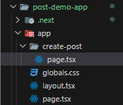
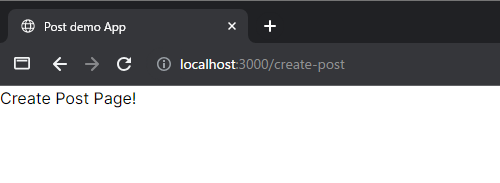
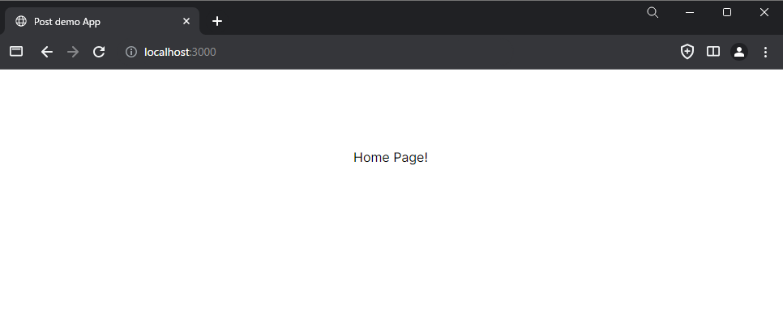
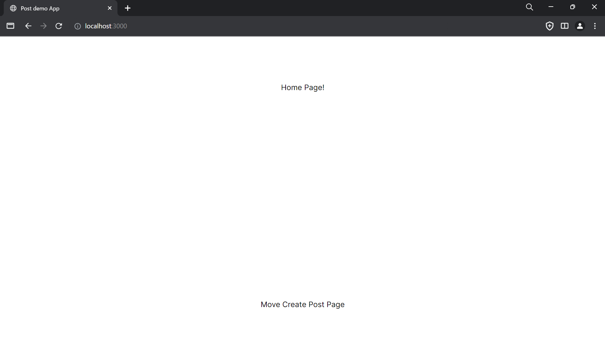

# フロントエンド
>What is Frontend Development?
Frontend development is the creation of a website that you interact with directly (client-side). It is the development of everything on a website that you experience including icons, buttons, fonts, layout, color, etc. With a click of a button, you see the magic happening which is submitting a form, playing a video, navigating to a new page, etc.
HTML, CSS, and JavaScript are used to structure and add styles, color, layouts, and functioning to the website respectively. Frontend developers also use various other tools and technologies to build a completely functional website.
(geeksforgeeks, What is Frontend Development? Skills, Salary and Roles, https://www.geeksforgeeks.org/what-is-frontend-development/, 2024/06/27)

**日本語訳**
フロントエンド開発とは？
フロントエンド開発とは、お客様が直接操作するウェブサイト（クライアントサイド）の開発です。アイコンやボタン、フォント、レイアウト、色など、ユーザーが体験するウェブサイト上のすべてを開発することです。ボタンをクリックすると、フォームを送信したり、ビデオを再生したり、新しいページに移動したりといったマジックが起こります。

HTML、CSS、JavaScriptは、それぞれウェブサイトの構造やスタイル、色、レイアウト、機能の追加に使用されます。フロントエンド開発者はまた、完全に機能的なウェブサイトを構築するために、他の様々なツールや技術を使用します。

# 1. ルート
## 1-1 フォルダ構成
Next.jsは、フォルダによってルートが定義されます。
例えば、 `app/create-post` というフォルダ構成になると [http://localhost:3000/create-post](http://localhost:3000/create-post) にアクセスすることで `app/create-post/page.tsx` の内容が表示されます。

実際に作成してみましょう。



上の写真のように、 `create-post` を作りその中に `page.tsx` を作成してください。
そして、 `page.tsx` に次のように書き加えて保存しましょう。

```tsx
export default function CreatePost() {
  return <h1>Create Post Page!</h1>
}
```

そして、サーバーを立ち上げた状態で [http://localhost:3000/create-post](http://localhost:3000/create-post) にアクセスしてみましょう。
次の写真のように表示されると思います。



`app/page.tsx` の内容も少し変更してみます。

```tsx
import Image from "next/image"

export default function Home() {
  return (
    <main className="flex min-h-screen flex-col items-center justify-between p-24">
      Home Page!
    </main>
  )
}
```

次は [http://localhost:3000](http://localhost:3000) にアクセスしてみましょう。



表示が少し違っていることがわかると思います。
[http://localhost:3000](http://localhost:3000) の方は文字が中央に寄っているのは `tailwind.css` によって装飾が加えられているためです。この部分は [「2. 装飾」](./front-end_2.md) で紹介します。


## 1-2 Linkコンポーネント
アクセスするページのURLとフォルダの名前の関係が分かったと思います。しかし、今のままではURLを直接書き換えて移動することしかできません。そこで、`Link` コンポーネントを使用してクリックすることで移動できるようにしていきます。

`app/page.tzx` を次のように書き換えてみましょう。

```tsx
 import Link from 'next/link' //Linkコンポーネントを使えるようにインポートしている
import Image from "next/image"

export default function Home() {
  return (
    <main className="flex min-h-screen flex-col items-center justify-between p-24">
      Home Page!
       <Link href='/create-post'>Move Create Post Page</Link> {/* Linkコンポーネントを追加 */}
    </main>
  )
}
```

[http://localhost:3000](http://localhost:3000) でのブラウザ表示は次のようになると思います。



新しく表示された `Move Create Post Page` をクリックしてみましょう。
[http://localhost:3000/create-post](http://localhost:3000/create-post) のページに移動したｔ思います。

次は、`app/create-post/page.tsx` を書き換えて [http://localhost:3000](http://localhost:3000) にクリックで戻れるようにしてみましょう。

<details>

<summary>app/create-post/page.tsx の実装例</summary>

移動先はルートディレクトリ（１番上の階層）なので移動先の指定は `/` とします。そして、`return` できる要素はひとつに括る必要があるので `()` と適当なタグ (ここでは <></>) を作って囲います。
 
```tsx
import Link from 'next/link' //Linkコンポーネントを使えるようにインポートしている

export default function CreatePost() {
  return (
    <>　{/* ひとつに括っている */}
      <h1>Create Post Page!</h1>
      <Link href='/'>Move Create Post Page</Link> {/* Linkコンポーネントを追加 */}
    </>
  )
  
}
```

</details>


## 1-3 useRouter()
Linkコンポーネント以外にもページ遷移する方法は `useRouter()` 等いくつかの方法があります。
ここでは詳細な説明はしないので、[NEXT.js, Linking and Navigating](https://nextjs.org/docs/app/building-your-application/routing/linking-and-navigating#userouter-hook) を参照してください。Linkコンポーネント以外を利用することで様々な方法でのページ遷移が実装できるようになるので活用してください。


---
[「2. 装飾」に進む](./front-end_2.md)
