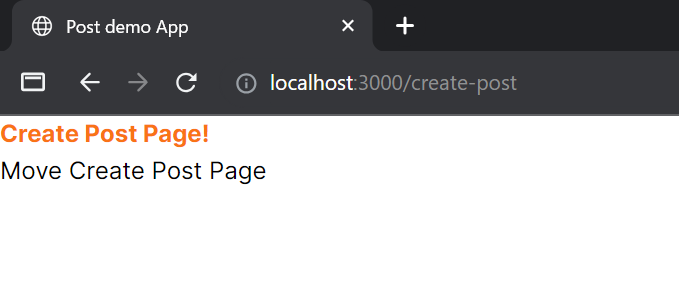
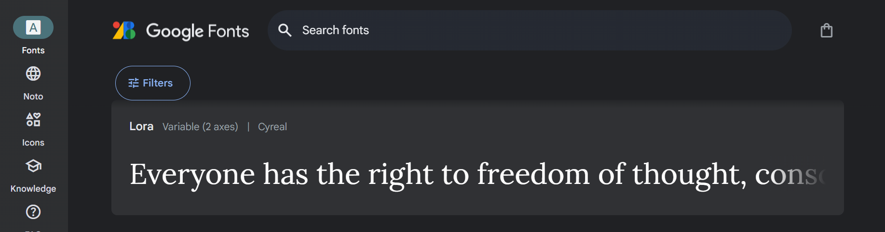

# 2. 装飾

## 2-1 tailwindCSS

> Tailwind CSS works by scanning all of your HTML files, JavaScript components, and any other templates for class names, generating the corresponding styles and then writing them to a static CSS file.
> (tailwindcss, Installation, https://tailwindcss.com/docs/installation, 2024/06/27)

**日本語訳**
Tailwind CSS は、すべての HTML ファイル、JavaScript コンポーネント、その他のテンプレートをスキャンしてクラス名を探し、対応するスタイルを生成し、静的な CSS ファイルに書き込むことで動作します。

tailwindCSS を使うことで、タグにクラス名を与えるだけで CSS の装飾を与えることができるようになります。Next.js をインストールする際に聞かれた質問の中に tailwindCSS を使用するか聞かれそのまま Enter を押している場合はもうすでに使える状態になっています。

少し触れましたが、`app/page.tsx` の `<main></main>` を確認すると `className` というのがついていることが分かります。

```tsx
import Link from "next/link";
import Image from "next/image";

export default function Home() {
  return (
    <main className="flex min-h-screen flex-col items-center justify-between p-24">
      Home Page!
      <Link href="/create-post">Move Create Post Page</Link>
    </main>
  );
}
```

この `className` の中身によって対応した CSS がタグに付与されます。 `<main></main>` では、中央寄せ、縦並びの間隔、周囲の余白などが指定されています。

それでは、`app/create-app/page.tsx` で tailwindCSS を試してみましょう。
`<h1></h1>` に `className='font-bold text-orange-500'` を追加してみます。

```tsx
import Link from "next/link";

export default function CreatePost() {
  return (
    <>
      <h1 className="font-bold text-orange-500">Create Post Page!</h1>{" "}
      {/* className の追加*/}
      <Link href="/">Move Create Post Page</Link>
    </>
  );
}
```



`<h1></h1>` の内容に太字＆オレンジ色の装飾ができたと思います。
次に `<></>` と `<Link></Link>` も少し装飾してみます。
`<></>` は、ひとつに囲うためだけに使っていたので装飾する前に `<div></div>` に変更しておきます。

```tsx
import Link from "next/link";

export default function CreatePost() {
  return (
    <div className="flex flex-col items-center m-8">
      <h1 className="font-bold text-orange-500">Create Post Page!</h1>
      <Link
        href="/"
        className="mt-4 p-4 rounded-md bg-amber-600 text-white hover:bg-amber-950"
      >
        Move Create Post Page
      </Link>
    </div>
  );
}
```


自在に見た目を変化させるには CSS の知識が必要になるので、他の教材（progate など）で学習して [tailwindCSS (例：Font Size)](https://tailwindcss.com/docs/font-size) で参照してどのようにクラス名を付与するといいか確認して使ってみましょう。

## 2-2 Google font

参照：[NEXT.js, Font Optimization](https://nextjs.org/docs/app/building-your-application/optimizing/fonts#google-fonts)

[Google font](https://fonts.google.com/) で提供されているフォントを使用することができます。
使用するには `next/font/google` からインポートする必要があります。
実際に `app/create-app/page.tsx` で使用してみましょう。

まず、使用したいフォントを [Google font](https://fonts.google.com/) で探します。
ここでは、 `lora` を使用しています。



```tsx
import Link from "next/link";
import { Lora } from "next/font/google"; // 'next/font/google' を使って 'Lora' をインポート

// Loraの情報を整理
const lora = Lora({
  weight: ["400", "500", "600", "700"],
  subsets: ["latin"],
});

export default function CreatePost() {
  return (
    <div className="flex flex-col items-center m-8">
      <h1 className={`font-bold text-orange-500 ${lora.className}`}>
        Create Post Page!
      </h1>{" "}
      {/* className の内容にフォントの情報を加えている */}
      <Link
        href="/"
        className="mt-4 p-4 rounded-md bg-amber-600 text-white hover:bg-amber-950"
      >
        Move Create Post Page
      </Link>
    </div>
  );
}
```

ブラウザで確認すると `Create Post Page!` のフォントが変わったことが分かると思います。


複数のフォントをインポートして使ってみましょう。

## 2-3 Image コンポーネント

画像を表示するためには、`next/image` から `Image` コンポーネントをインポートする必要があります。
今回は `app/page.tsx` で使ってみます。
まずは、`public` 内に好きな画像を保存しておいてください。


`app/page.tsx` に次のように `next/image` と `保存した画像` をインポートして、画像を表示してみます。

```tsx
import Link from "next/link";
import Image from "next/image";
import sample_img from "@/public/sample_1.png";

export default function Home() {
  return (
    <main className="flex min-h-screen flex-col items-center justify-between p-24">
      Home Page!
      <Link href="/create-post">Move Create Post Page</Link>
      <Image src={sample_img} alt="Sample image" width={200} height={300} />
    </main>
  );
}
```

ブラウザ表示は次のようになると思います。


`Image` タグも `className` を用いて `taliwindCSS` をあてることができるのでいろいろ調整してみましょう。

<br><br>

### <課題> 複数フォントの実装

<details>

<summary><big>複数フォントの実装例</big></summary>

### app/create-app/page.tsx

```tsx
import Link from "next/link";
import { Lora, Teko } from "next/font/google";

const lora = Lora({
  weight: ["400", "500", "600", "700"],
  subsets: ["latin"],
});

const teko = Teko({
  weight: ["300", "600"],
  subsets: ["latin"],
});

export default function CreatePost() {
  return (
    <div className="flex flex-col items-center m-8">
      <h1 className={`font-bold text-orange-500 ${lora.className}`}>
        Create Post Page!
      </h1>
      <Link
        href="/"
        className={`mt-4 p-4 rounded-md bg-amber-600 text-white hover:bg-amber-950 ${teko.className}`}
      >
        Move Create Post Page
      </Link>
    </div>
  );
}
```

### ブラウザ表示


</details>

複数のフォントをインポートして使えたら、[Using Multiple Fonts](https://nextjs.org/docs/app/building-your-application/optimizing/fonts#using-multiple-fonts) を参考にフォントのインポート専用ファイルを作成してみましょう。

<br>

---

[「 1. ルート 」に戻る](./front-end_1.md)　｜　[「 3. React Hooks 」に進む](./front-end_3.md)
