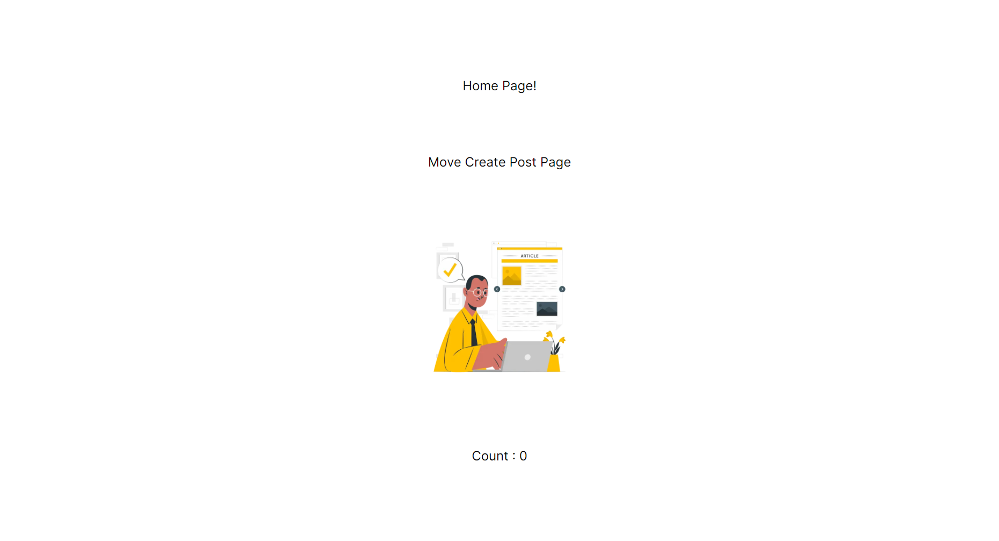
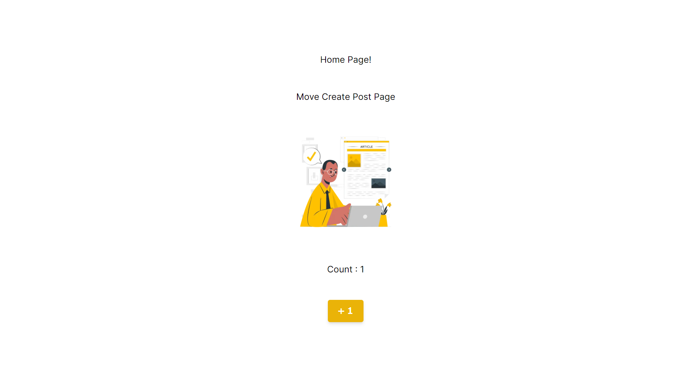

# 3. React Hooks

Web アプリを作成していく中でデータのやり取りを扱う必要が出てくると思います。そのときにデータを簡単に扱うことができるよう React Hooks というものが用意されています。子声はの代表的なものを紹介します。下記のサイトを参考にしているので不明点や詳細を知りたい方は参考にしてください。

- 参考
  [state の管理](https://ja.react.dev/learn/managing-state)
  [組み込みの React フック](https://ja.react.dev/reference/react/hooks)

## 3-1 useState

早速ですが、 `useState` を使ってみましょう！
今回は `app/page.tsx` に記述して行きます。

まずは `import { useState } from "react"` を記述して `useState` を使えるようにします。

```tsx
// app/page.tsx

'use client' // next.jsでは、use～を使うとき大体必要になります。（クライアントサーバー）

import Link from 'next/link'
import Image from 'next/image'
import sample_img from '@/public/sample_1.png'

import { useState } from 'react' // useStateをインポート

export default function Home() {
  return (
```

次に実際に使用する部分を記述していきます。

```tsx
export default function Home()
  const [count, setCount] = useState(0); // 実際に使用するStateの宣言

  return (
    <main className="flex min-h-screen flex-col items-center justify-between p-24">
      Home Page!
      <Link href="/create-post">Move Create Post Page</Link>
      <Image src={sample_img} alt="Sample image" width={200} height={300} />
    </main>
  );
}
```

実際に利用する前に記述した内容について簡単に説明します。

```tsx
const [count, setCount] = useState(0);
```

最初の `const` は、変数を初期設定するための宣言になります。
`[count, setCount]` が実際に使用する部分になります。名前は自由につけることができますが、わかりやすいように前につけた名前に `set` とつけることが多いと思います。その理由は、変数と同様に値を持つ部分が `count` になり、この `count` が持つ値を設定するのが `setCount` になるためです。ただ初期値は `useState(0)` の部分で設定します。ここでは `0` を設定しています。

では、実際に確認してみましょう！

```tsx
return (
  <main className="flex min-h-screen flex-col items-center justify-between p-24">
    Home Page!
    <Link href="/create-post">Move Create Post Page</Link>
    <Image src={sample_img} alt="Sample image" width={200} height={300} />
    <h1>Count : {count}</h1>　{/*countの値を表示*/}
  </main>
);
```

ここでは、`return(...)` 内では変数などの値を使用する場合には `{}` が必要になります。
それでは、`http://localhost:3000` で `count` が表示されているか確認してみましょう。



`<h1>Count : {count}</h1>` の部分が `Count : 0` と表示されていますね！

次にこの値を変化させてみます。
変化させるためのボタンを先に作成します。せっかくなので `TailwindCSS` を使って自分好みの見たん目にしてみましょう！

```tsx
return (
  <main className="flex min-h-screen flex-col items-center justify-between p-24">
    Home Page!
    <Link href="/create-post">Move Create Post Page</Link>
    <Image src={sample_img} alt="Sample image" width={200} height={300} />
    <h1>Count : {count}</h1>
    <button className="bg-yellow-500 py-2 px-4 rounded font-bold text-white shadow-md duration-300 hover:shadow-none">
      ＋１
    </button>
  </main>
);
```


ボタンができましたが、まだクリックしても何も起こらないので機能を追加します。

```tsx
export default function Home() {
  const [count, setCount] = useState(0);

  // setCountを使ってcountを増やす関数
  const countUp = () => {
    setCount(count + 1); // 現在のcountに１足した値をcountに設定してます。
  };

  return (
    <main className="flex min-h-screen flex-col items-center justify-between p-24">
      Home Page!
      <Link href="/create-post">Move Create Post Page</Link>
      <Image src={sample_img} alt="Sample image" width={200} height={300} />
      <h1>Count : {count}</h1>
      <button
        onClick={countUp} // クリックされたときにcountUp関数を呼び出しています。
        className="bg-yellow-500 py-2 px-4 rounded font-bold text-white shadow-md duration-300 hover:shadow-none"
      >
        ＋１
      </button>
    </main>
  );
}
```

`countUp` 関数を作成して、ボタンがクリックされたときにその関数を呼び出せるように `onClick` を使用をしています。
では、ボタンをクリックして `count` が増えるか確認してみましょう。



クリックする度に増えていくようになったと思います。
<br><br>

### < 課題 > 減少ボタンの実装

これまでを参考にして逆に値が減少するボタンも作成してみましょう！

<details>

<summary><big>減少ボタンの実装例</big></summary>

### app/page.tsx

```tsx
"use client";

import Link from "next/link";
import Image from "next/image";
import sample_img from "@/public/sample_1.png";

import { useState } from "react";

export default function Home() {
  const [count, setCount] = useState(0);

  const countUp = () => {
    setCount(count + 1);
  };
  const countDown = () => {
    setCount(count - 1);
  };

  return (
    <main className="flex min-h-screen flex-col items-center justify-between p-24">
      Home Page!
      <Link href="/create-post">Move Create Post Page</Link>
      <Image src={sample_img} alt="Sample image" width={200} height={300} />
      <h1>Count : {count}</h1>
      <div>
        <button
          onClick={countDown}
          className="bg-yellow-500 py-2 mx-2 px-4 rounded font-bold text-white shadow-md duration-300 hover:shadow-none"
        >
          －１
        </button>
        <button
          onClick={countUp}
          className="bg-yellow-500 py-2 mx-2 px-4 rounded font-bold text-white shadow-md duration-300 hover:shadow-none"
        >
          ＋１
        </button>
      </div>
    </main>
  );
}
```

### ブラウザ表示


</details>

<br>
<br>

---

[「2. 装飾」に進む](./front-end_2.md)　｜　[「 4. Component 」に進む](./front-end_4.md)
