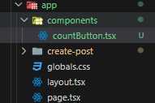

# 4. Component

アプリ内で同じような要素（ボタン等）は何度も使用されることがあります。しかし、そのたびに同じ形で作成（コピペするなど）するのは大変です。そのため、作成した要素を何度も使用できるようにするため作成した要素を部品のように分けて好きな場所で使用できるようにします。この部品にあたるものをコンポーネントと呼びます。ここでは、コンポーネントを作成していきたいと思います。

## 4-1 コンポーネント作成

前回作成したものを編集していきます。
下の写真の青色で囲われた部分をコンポーネントにしていきます。


```tsx
// app/page.tsx
"use client";

import Link from "next/link";
import Image from "next/image";
import sample_img from "@/public/sample_1.png";

import { useState } from "react";

export default function Home() {
  const [count, setCount] = useState(0);

  const countUp = () => {
    setCount(count + 1);
  };
  const countDown = () => {
    setCount(count - 1);
  };

  return (
    <main className="flex min-h-screen flex-col items-center justify-between p-24">
      Home Page!
      <Link href="/create-post">Move Create Post Page</Link>
      <Image src={sample_img} alt="Sample image" width={200} height={300} />
      <h1>Count : {count}</h1>
      <div>
        {/* ↓　ここの部分をコンポーネントにしていきます。*/}
        <button
          onClick={countDown}
          className="bg-yellow-500 py-2 mx-2 px-4 rounded font-bold text-white shadow-md duration-300 hover:shadow-none"
        >
          －１
        </button>
        <button
          onClick={countUp}
          className="bg-yellow-500 py-2 mx-2 px-4 rounded font-bold text-white shadow-md duration-300 hover:shadow-none"
        >
          ＋１
        </button>
      </div>
    </main>
  );
}
```

まず、 `app/components` というコンポーネントを配置するためのディレクトリを作成します。


そして、そのディレクトリ内に `countButton.tsx` を作成して下記のように基本的なコードを記述しておきましょう。



```tsx
// app/components/countButton.tsx
export const CountButton = () => {
  return <></>;
};
```

それでは改めてコンポーネントにしていく部分を確認してみます。

```tsx
// app/page.tsx
const [count, setCount] = useState(0);

const countUp = () => {
  setCount(count + 1);
};
const countDown = () => {
  setCount(count - 1);
};
```

```tsx
// app/page.tsx
<button
  onClick={countDown}
  className="bg-yellow-500 py-2 mx-2 px-4 rounded font-bold text-white shadow-md duration-300 hover:shadow-none"
>
  －１
</button>
<button
  onClick={countUp}
  className="bg-yellow-500 py-2 mx-2 px-4 rounded font-bold text-white shadow-md duration-300 hover:shadow-none"
>
  ＋１
</button>
```

↑ の `count` を変化させる関数と `button` 要素になります。
では、早速コンポーネントを作成してみます。

上記の部分をすべて先ほど作成した `app/components/countButton.tsx` に書き写していきます。

```tsx
// app/components/countButton.tsx
"use client";

import { useState } from "react";

export const CountButton = () => {
  const [count, setCount] = useState(0);

  const countUp = () => {
    setCount(count + 1);
  };
  const countDown = () => {
    setCount(count - 1);
  };
  return (
    <div className="flex">
      <button
        onClick={countDown}
        className="bg-yellow-500 py-2 mx-2 px-4 rounded font-bold text-white shadow-md duration-300 hover:shadow-none"
      >
        －１
      </button>
      <button
        onClick={countUp}
        className="bg-yellow-500 py-2 mx-2 px-4 rounded font-bold text-white shadow-md duration-300 hover:shadow-none"
      >
        ＋１
      </button>
    </div>
  );
};
```

これで、`countButton` のコンポーネントが作成できました。これを実際に使用してみます。
今のままだと、`app/page.tsx` に前に作成したものが残っているので削除します。

```tsx
// app/page.tsx
"use client";

import Link from "next/link";
import Image from "next/image";
import sample_img from "@/public/sample_1.png";
import { useState } from "react";

export default function Home() {
  const [count, setCount] = useState(0);

  return (
    <main className="flex min-h-screen flex-col items-center justify-between p-24">
      Home Page!
      <Link href="/create-post">Move Create Post Page</Link>
      <Image src={sample_img} alt="Sample image" width={200} height={300} />
      <h1>Count : {count}</h1>
    </main>
  );
}
```

不要なものを削除すると `button` が消えたと思います。
ここに作成したコンポーネントを追加します。

```tsx
// app/page.tsx
"use client";

import Link from "next/link";
import Image from "next/image";
import sample_img from "@/public/sample_1.png";
import { useState } from "react";
import { CountButton } from "./components/countButton"; // ← コンポーネントのインポート

export default function Home() {
  const [count, setCount] = useState(0);

  return (
    <main className="flex min-h-screen flex-col items-center justify-between p-24">
      Home Page!
      <Link href="/create-post">Move Create Post Page</Link>
      <Image src={sample_img} alt="Sample image" width={200} height={300} />
      <h1>Count : {count}</h1>
      <CountButton /> {/* ← コンポーネント */}
    </main>
  );
}
```

これで `button` がまた表示されたと思います。しかし、 `button` をクリックしても表示は変わらないと思います。これは、 `app/page.tsx` の `count` ではなく `app/component/countButton.tsx` の `count` の値が変化しているため、表示値が変化していません。そのため、次は `app/components/countButton.tsx` から `app/page.tsx` の `count` を変化できるようにしていきます。
では、`app/components/countButton.tsx` を編集していきます。

```tsx
// app/components/countButton.tsx
"use client";

// import { useState } from "react";  ← 削除

type Props = {
  count: number;
  setCount: Function;
};

export const CountButton = ({ count, setCount }: Props) => {
  // const [count, setCount] = useState(0);  ← 削除

  const countUp = () => {
    setCount(count + 1);
  };
  const countDown = () => {
    setCount(count - 1);
  };
  return (
    <div className="flex">
      <button
        onClick={countDown}
        className="bg-yellow-500 py-2 mx-2 px-4 rounded font-bold text-white shadow-md duration-300 hover:shadow-none"
      >
        －１
      </button>
      <button
        onClick={countUp}
        className="bg-yellow-500 py-2 mx-2 px-4 rounded font-bold text-white shadow-md duration-300 hover:shadow-none"
      >
        ＋１
      </button>
    </div>
  );
};
```

今どう変化させたのか簡単に説明します。`app/page.tsx` の `count` と `setCount` が使いたいので、使わない `app/components/countButton.tsx` の `count` と `setCount` を削除しています。そして、 `Props` という `app/page.tsx` から受け取るデータの型を定義して、`export const CountButton = ({count, setCount}: Props) => {` の部分で受け取っています。
では、`app/page.tsx` も編集していきましょう。

```tsx
// app/components/countButton.tsx
"use client";

import Link from "next/link";
import Image from "next/image";
import sample_img from "@/public/sample_1.png";
import { useState } from "react";
import { CountButton } from "./components/countButton";

export default function Home() {
  const [count, setCount] = useState(0);

  return (
    <main className="flex min-h-screen flex-col items-center justify-between p-24">
      Home Page!
      <Link href="/create-post">Move Create Post Page</Link>
      <Image src={sample_img} alt="Sample image" width={200} height={300} />
      <h1>Count : {count}</h1>
      <CountButton count={count} setCount={setCount} />
    </main>
  );
}
```

`<CountButton count={count} setCount={setCount} />` の部分が加えられています。これは、`app/components/countButton.tsx` に記述した`export const CountButton = ({count, setCount}: Props) => {` の内容と一致させます。`渡す名前 = {渡す変数}` といった形になっています。今回はどちらも同じ名前にしましたが、場合によっては違う名前にして使用できます。

では、ブラウザで実際に機能するか確認してみてください。ボタンをクリックすることで count が変化すれば正しく実装されています。

コンポーネントを作成する理由としては、最初に述べたように同じ機能を持った要素を簡単に何度も使用しやすくしてくれます。試しに、次のように変更してみます。

```tsx
"use client";

import Link from "next/link";
import Image from "next/image";
import sample_img from "@/public/sample_1.png";
import { useState } from "react";
import { CountButton } from "./components/countButton";

export default function Home() {
  const [count, setCount] = useState(0);

  return (
    <main className="flex min-h-screen flex-col items-center justify-between p-24">
      Home Page!
      <Link href="/create-post">Move Create Post Page</Link>
      <Image src={sample_img} alt="Sample image" width={200} height={300} />
      <h1>Count : {count}</h1>
      <CountButton count={count} setCount={setCount} />
      <CountButton count={count} setCount={setCount} />
    </main>
  );
}
```

作成したコンポーネント `<CountButton count={count} setCount={setCount} />` を１つ増やしています。こうすることによって他のページにもインポートして上記のように追加することで簡単に追加できます。


何度も使用できるほかに開発の段階で、コードが長くなりどこに何を書いたかわからなくなるのを部品ごとに管理できるようになるため編集しやすくなります。最初は慣れなく面倒に感じるかと思いますが、後々楽になる作業なので活用してください。また、次に説明するサーバーサイドコンポーネントとクライアントサイドコンポーネントと言って役割が
異なるので自在に作成・使用できるようになりましょう。

---

[「 3. React Hooks 」に戻る](./front-end_3.md)　｜　[「 5. Server/Client」に進む](./front-end_5.md)
