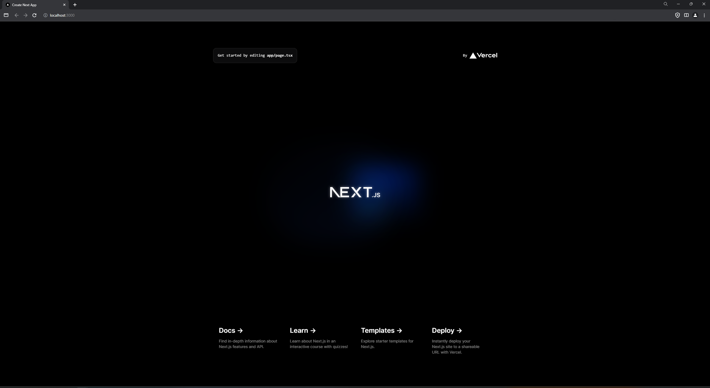

# 2. インストール
ここでの説明は [Next.js, Getting Started > Installation](https://nextjs.org/docs/getting-started/installation) の内容を参考にしているので進めながらわからないところがあれこちらを確認してください。

## 2-1 Node.jsの確認
next.js をインストールするためには、Node.js(v18.17以降)が必要となります。
次のコマンドで Node.js のバージョンを確認しましょう。

```Terminal
$ node -v
```
または
```Terminal
$ node --version
```

コマンドを実行すると次のような表示が出てくると思います。

```Terminal
v20.15.0
```

`20.15.0` の部分が `18.17.0` より大きい数字であれば大丈夫です。


## 2-2 Next.jsのインストール
Node.js の確認出来たら、次に Next.js のインストールをしましょう。
次のコマンドで新しい Next.js のプロジェクトをインストールします。

```Terminal
$ npx create-next-app@latest
```

実行すると次のような表示が出てきます。

```Terminal
What is your project named? my-app
```

`my-app` の部分に自身のプロジェクト名を入力して Enter を押しましょう。
すると、質問が何度か表示され `No/Yes` の選択ができます。
ここではすべて基本の設定のまま進めるので、こだわりがなければそのまま Enter を押してください。
(ここでは、プロジェクト名を `post-demo-app` としてます。)

```Terminal
✔ What is your project named? … post-demo-app
✔ Would you like to use TypeScript? … No / Yes
✔ Would you like to use ESLint? … No / Yes
✔ Would you like to use Tailwind CSS? … No / Yes
✔ Would you like to use `src/` directory? … No / Yes
✔ Would you like to use App Router? (recommended) … No / Yes
✔ Would you like to customize the default import alias (@/*)? … No / Yes
```

すべての質問に対して Enter を押し終わると１～２分程度でプロジェクトのインストールが完了します。
下のような表示が出ていたら問題なくインストールされています。

```
Success! Created post-demo-app at /home/jangwong/workspace/log/nextjs_handson/post-demo-app
```

## 2-3 動作確認
実際にインストールしたプロジェクトを確認してみましょう。
まず、現在のディレクトリの確認をします。

```
$ ls
```

上のコマンドを実行すると今いるディレクトリ内の情報が次のように表示されると思います。
（`post-demo-app` の部分が自身で決めたプロジェクト名になってると思います。）

```
post-demo-app
```

次に、表示されたプロジェクトのディレクトリに移動します。

（`post-demo-app` の部分を自身のプロジェクト名に合わせて変えてください。）

```
$ cd post-demo-app
```

そして、次のコマンドで開発サーバーを立ち上げます。

```
$ npm run dev
```

実行すると、次のような表示が出てきます。

```
  ▲ Next.js 14.2.4
  - Local:        http://localhost:3000

 ✓ Starting...
Attention: Next.js now collects completely anonymous telemetry regarding usage.
This information is used to shape Next.js' roadmap and prioritize features.
You can learn more, including how to opt-out if you'd not like to participate in this anonymous program, by visiting the following URL:
https://nextjs.org/telemetry

 ✓ Ready in 11.8s
```

`✓ Ready in XX.Xs` まで表示されたら `http://localhost:3000` をブラウザで開いてみましょう。



上の写真のように表示されれば無事サーバーが立ち上げられてます。


---
[「 1. はじめに 」に戻る](./get-started_1.md)　｜　[「 3. 初期設定 」に進む](./get-started_3.md)