# 3. 初期設定
開発サーバーを立ち上げるとブラウザで次のような表示が確認できたと思います。

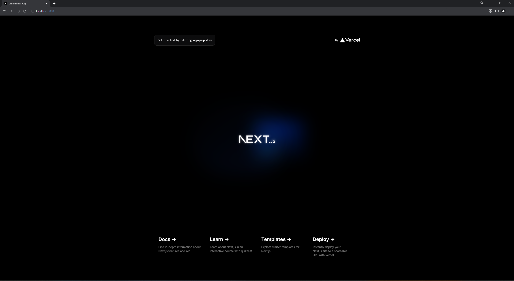

ここで表示されているのは、あらかじめ用意されているものでありこれから作るアプリには不必要なものが多くあるのでそれらを削除していきます。

## 3-1 page.tsx
プロジェクトのディレクトリは次の写真のようになっていると思います。

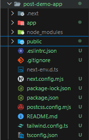

ここで基本的には `app` の中のファイルやディレクトリを編集してWebアプリを作っていきます。
まずは、 `app/page.tsx` を開いてみましょう。

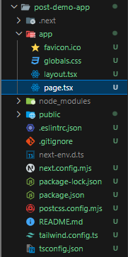
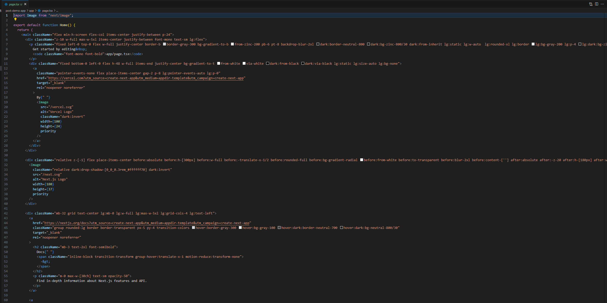

`page.tsx` の中身は上の写真のようにたくさん書かれていると思います。
しかし、このほとんどが不要なものなので `<main ～>` と `</main>` で囲われている中身をすべて削除して下のような状態にしましょう。

```tsx
import Image from "next/image";

export default function Home() {
  return (
    <main className="flex min-h-screen flex-col items-center justify-between p-24">
      
    </main>
  );
}

```

この状態で　ブラウザ（ `http://localhost:3000` ）にどのように表示されているか確認すると下の写真のようになっていると思います。
（もし、ブラウザに表示されないときはターミナルで再度 `npm run dev` を実行してみてください。）


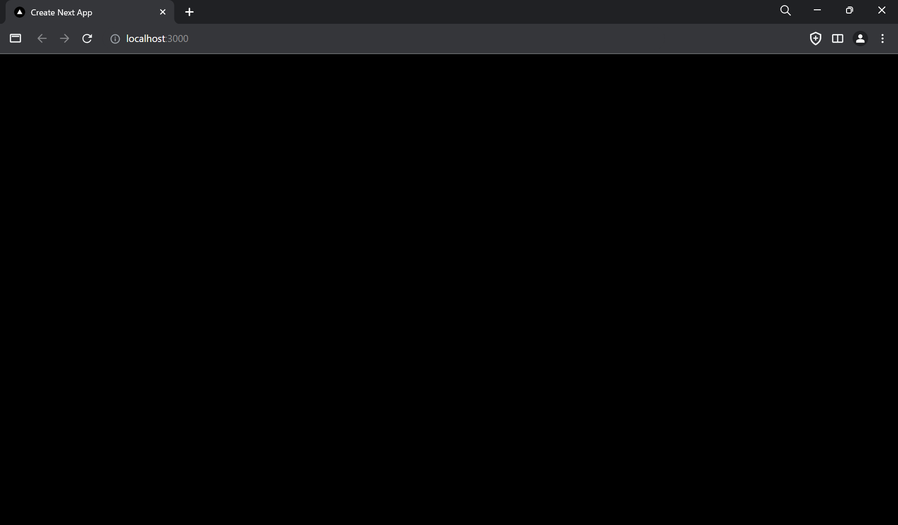


## 3-2 globals.css
次にHTMLの装飾を行うCSSの不要な部分を削除していきます。
まず、 `app/globals.css` を開きましょう。

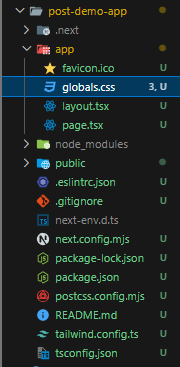
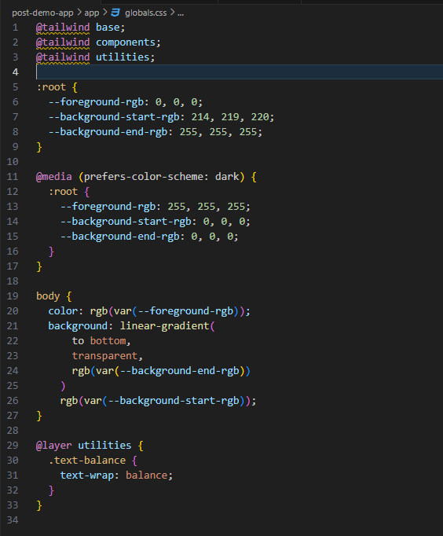

ここでは、`@tailwind` から始まる部分以外を削除して次のような状態にしてください。
（削除する部分は基本的には背景の色を設定しています。）

```css
@tailwind base;
@tailwind components;
@tailwind utilities;
```

ブラウザ（ `http://localhost:3000` ）での表示が次のように変わっていると思います。

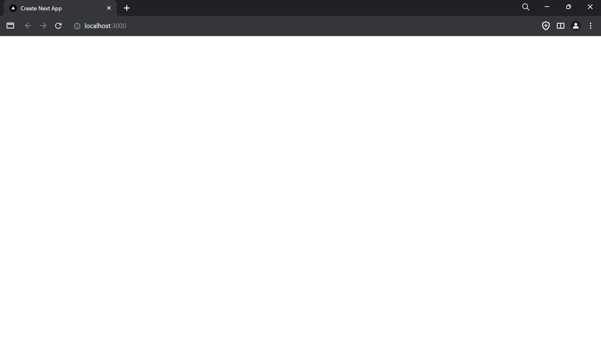


## 3-3 画像
先ほど削除した部分で使われていた画像を削除します。
画像や動画などは `public` に保存してあります。`public` 内にある `next.svg` と `vercel.svg` を削除しましょう。

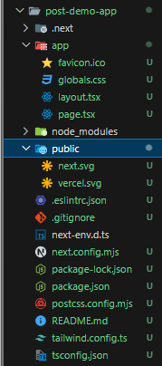

削除すると `public` の中身は何もない状態になったと思います。
そして、ブラウザのタブ部分に使われている画像も削除しておきましょう。
タブ部分の画像は `favicon.ico` という名前で `app/favicon.ico` の位置にあります。


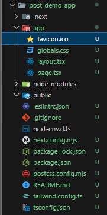

削除すると `▼` のロゴがなくなるのが確認できます。

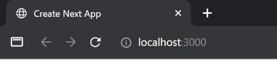


## 3-4 layout.tsx
次にタブに表示されている名前を修正します。
`app/layout.tsx` を開くと次のようになっていると思います。

```tsx
import type { Metadata } from "next";
import { Inter } from "next/font/google";
import "./globals.css";

const inter = Inter({ subsets: ["latin"] });

export const metadata: Metadata = {
  title: "Create Next App",
  description: "Generated by create next app",
};

export default function RootLayout({
  children,
}: Readonly<{
  children: React.ReactNode;
}>) {
  return (
    <html lang="en">
      <body className={inter.className}>{children}</body>
    </html>
  );
}
```

`layout.tsx` は、複数のページの間で共有されるUIになります。詳細はフロントエンドの説明に記載しています。ここで設定されているのは、文字フォントと metadata（タブに表示される情報など）があります。metadata を修正してみましょう。

```tsx
export const metadata: Metadata = {
  title: "Post demo App",
  description: "make post demo app",
};
```

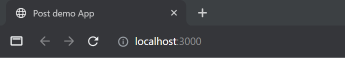

上のように自身のプロジェクトにあった記述に修正して保存するとブラウザのタブ表示が変化していると思います。


これで、不要なファイルが削除され自身のプロジェクトを作り始めることができるようになりました。


---

[「 2. インストール 」に戻る](./get-started_2.md)